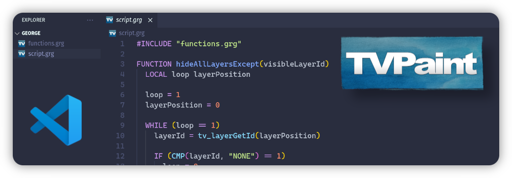

# George language support for VSCode

This extension adds syntax highlighting support for [TVPaint's George macro scripting language](https://wiki.tvpaint.com/index.php/George).

  </a>

## Features

- Syntax highlighting (see `syntaxes/george.tmLanguage.json`)

## Reference

- [George documentation](https://www.tvpaint.com/doc/tvp11/index.php?id=lesson-advanced-functions-george-program-description&lang=en)
- Inspired by the [`vscode-lua-plus`](https://github.com/jep-a/vscode-lua-plus) extension
- Original [GeorgeCode extension](https://github.com/Ankit-Patel10/GeorgeCode) from [Ankit-Patel10](https://github.com/Ankit-Patel10)

## Contributing

Pull requests are welcome. For major changes, please open an issue first
to discuss what you would like to change.

There might be built-in functions or keywords that doesn't appear so feel free to add them!

## Copyright

> Copyright © 1997-2022 TVPaint Developpement All rights reserved.
> All other trademarks and logos are property of their respective owners.

## License

[MIT](https://choosealicense.com/licenses/mit/)
